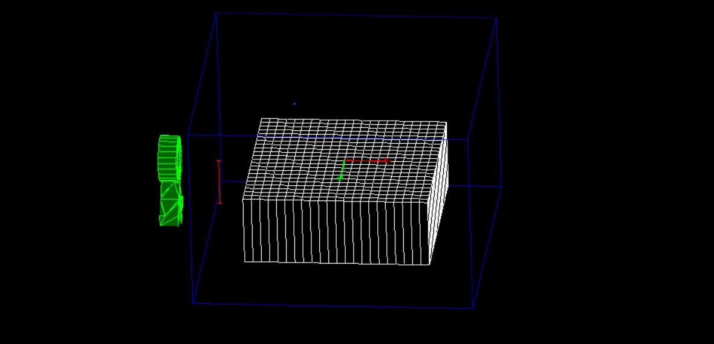

# cascade_energy_losses
Attempt to count losses of energy of cascades near to edges of detector

This project launch macrofile run3.mac where you can set position of particle gun
Detector is as a 22x22-grid of CsI strips with shape 36x36x296 mm 

for execute program with loop.mac edit file `cascades.cc`.  uncomment strings with vismanager applying and comment block with applying `run3.mac`. 
