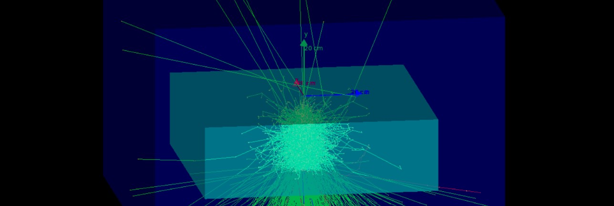

# cascade_energy_losses
This projet is created as part of my research work in MEPHI university in department of "expremental nuclear physics and space physics".
Briefly, my work is to explore how much energy of eletromagnetic cascades detector cannot registrate if the cascades rises near to edges of detector.

This project launch macrofile run3.mac where you can set position of particle gun
Detector is CsI box with shape 80x40x80

You can also launch program with macro file loop.mac that set particle gun in positions of grid 
            
X = (-40,-39, ... , 39, 40)  ,  Z = (-40,-39, ... , 39, 40)

for execute program with loop.mac edit file `cascades.cc`.  uncomment strings with vismanager applying and comment block with applying `run3.mac`. 
